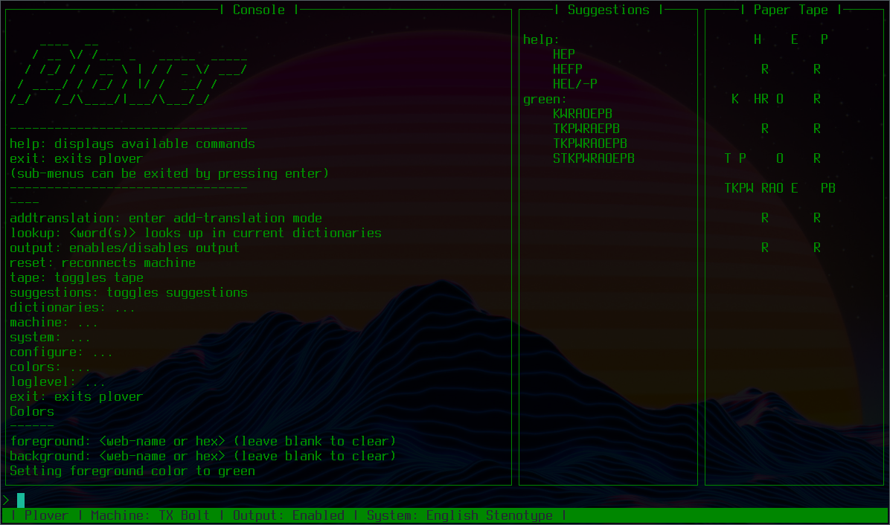

############################
Console UI Plugin for Plover
############################

.. image:: https://img.shields.io/pypi/v/plover_console_ui.svg
    :target: https://pypi.org/project/plover-console-ui/
.. image:: https://img.shields.io/pypi/dm/plover_console_ui.svg
    :target: https://pypi.org/project/plover-console-ui/

This is a plugin for the open source stenography program `Plover <https://www.openstenoproject.org/plover/>`_

Requires Plover version 4.0.0 or later

Run Plover entirely inside your terminal window!

###############
Getting Started
###############

1. Open Plover
#. Navigate to the Plugin Manager tool
#. Select ``plover_console_ui`` in the list
#. Click install

Or directly install ``plover_console_ui`` into Plover's python environment

Linux/Mac
=========

Start Plover with the --gui option:
``plover --gui console``

Windows
=======

Due to some Windows workaround code (in Plover), this plugin does not work well on the packaged Windows build

Here's a launcher that works:
``python -m plover --gui console``

Yes, it requires essentially 'run from source'... I'm sorry

#####
Usage
#####

Regular Use
===========

Plover commands are all functional:

- ``{PLOVER:LOOKUP}``
- ``{PLOVER:ADD_TRANSLATION}``
- ``{PLOVER:SUSPEND}``
- ``{PLOVER:RESUME}``
- ``{PLOVER:TOGGLE}``
- ``{PLOVER:FOCUS}``
- ``{PLOVER:CONFIGURE}``

Note for the commands which do window manager focus:

- ``LOOKUP``
- ``ADD_TRANSLATION``
- ``FOCUS``
- ``CONFIGURE``

This ``console_ui`` only knows which window it lives in *if* that window has focus on start-up

Otherwise: expect the focus feature not to work

Key Commands
============

These key commands are always available when ``console_ui`` has focus:

- ``Ctrl-C`` or ``Ctrl-Q``: Exits Plover
- ``PageUp/PageDown``: Scrolls the ``console`` buffer up/down

  (Note: if anything new is added to ``console`` it will auto-scroll back down)

Command Line
============

The ``help`` command is *always* available and will show all the currently
available commands

If a command has the description ``...`` there are further commands
contained inside

Commands can be partially entered

    ``m`` to use the ``machine`` command

Once you know your way around, you don't need to enter each menu one at a time

    ``col for goldenrod`` from the top level

Case is ignored 

    ``configure`` is the same as ``CONFIGURE``

To get back to the previous menu level, press ``Enter`` on its own

If a command has ``<>`` in its description it takes one or more arguments. The type
of the argument is between the ``<>``

Commands
========

- ``addtranslation``: enters ``ADD_TRANSLATION`` mode
- ``lookup``: enters ``LOOKUP`` mode
- ``output``: toggles Plover output on/off
- ``reset``: reconnects current ``machine``
- ``suggestions``: toggles suggestions display
- ``tape``: toggles paper tape display
- ``savetape``: saves content of tape to a file
- ``dictionaries``: configure dictionaries

  - ``add``: add a dictionary by its file path
  - ``remove``: remove a dictionary by displayed number
  - ``toggle``: toggle a dictionary by displayed number
  - ``priority``: prioritise a dictionary by displayed number (to its new number)

- ``machine``: configure ``machine``

  - ``options``: configure current machine options
  - (One 'set machine' command per installed ``machine`` plugin)
  
- ``system``: configure ``system``

  - (One 'set system' command per installed ``system`` plugin)

- ``configure``: Plover configuration commands

  - ``space_placement``: (Before Output|After Output)
  - ``start_attached``: (True|False)
  - ``start_capitalized``: (True|False)
  - ``undo_levels``: Number of undo levels
  - ``log_file_name``: Name of the log file
  - ``enable_stroke_logging``: Enable/Disable stroke logging
  - ``enable_translation_logging``: Enable/Disable translation logging
  - ``auto_start``: If 'True' enable Plover output on start-up
  - ``extensions``: Enable/Disable extension commands

    - (One 'toggle extension' command per installed ``extension`` plugin)

- ``colors``: set ``console_ui`` colors

  These commands take `web color names
  <https://www.w3schools.com/colors/colors_names.asp>`_
  
  Color hexes are also supported (e.g. ``#ffffff`` for white)
  
  (Note: not all terminals support all colors)
  
  - ``foreground``: set foreground color
  - ``background``: set background color

- ``loglevel``: configure which Plover log messages will get printed to ``console_ui``

  - ``WARNING``: any logs at ``WARNING`` or above will be printed
  - ``CRITICAL``: any logs at ``CRITICAL`` or above will be printed
  - ``ERROR``: any logs at ``ERROR`` or above will be printed
  - ``INFO``: any logs at ``INFO`` or above will be printed
  - ``DEBUG``: any logs at ``DEBUG`` or above will be printed

- ``exit``: exits ``console_ui`` (and Plover)

############
Contributing
############

Head to the `open source repository <https://github.com/psethwick/plover_console_ui>`_

Issues + PRs welcome!
